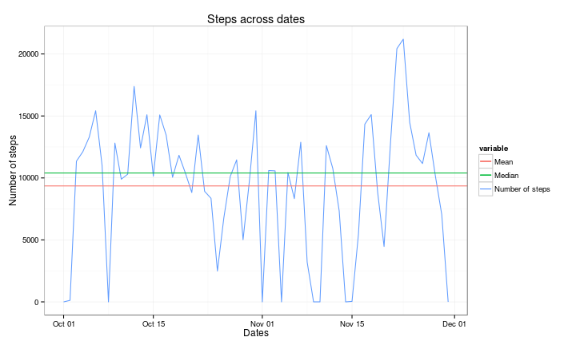
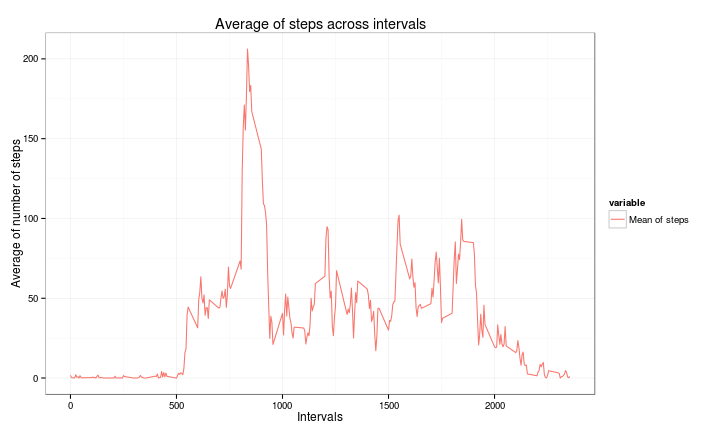

Reproducible Research Project 1
========================================================

This document contains the several steps followed on analysing the “quantified self” movement captured from mobile devices between October and November 2012.

The dataset can be downloaded from [GitHub](https://github.com/rdpeng/RepData_PeerAssessment1)

## Loading and preprocessing the data

First of all the data file is unzipped and loaded the CSV given the fact the file is on the working directory.


```r
library(ggplot2)
library(plyr)
library(data.table)
library(knitr)
library(utils)
library(stats)
library(reshape2)

##Unzips and loads the data
unzip("activity.zip")
activity <- read.csv("activity.csv")
activity$date<-as.Date(activity$date,"%Y-%m-%d")
```

## Aggregates (sum, mean and median) per day
There is a need of understanding the sum, mean and median of the steps across the several days. A global aggregated is calculated so a subset of it will be taken for each topic of interest.


```r
## Create the aggregates per year and location
subset_aggr<-ddply(activity, .(date), summarize, steps_sum=sum(steps, na.rm=T)) 
steps_mean<-mean(subset_aggr$steps_sum,na.rm=T)
steps_median<-median(subset_aggr$steps_sum,na.rm=T)
```

It's interesting to have an overview of the amount of steps per day along the period of analysis and realise there are some four days with NA only values. The mean is at **9354.2295** whereas the median is at **10395**.


```r
to_plot_mean <- data.frame(y = steps_mean, name = "Mean" )
to_plot_median <- data.frame(y = steps_median, name = "Median" )
to_plot <- melt(subset_aggr[,c("date","steps_sum")],id.vars=c("date"))
to_plot$variable<-factor(to_plot$variable,labels=c("Number of steps"))
g<-ggplot(to_plot,aes(y=value, x=date, colour=variable))
g + geom_line() + labs(x="Dates", y="Number of steps", title="Steps across dates") + theme_bw() + geom_hline(aes(yintercept=y, colour=name), data=to_plot_mean, show_guide=TRUE) + geom_hline(aes(yintercept=y, colour=name), data=to_plot_median, show_guide=TRUE) 
```

 

## Mean aggregate by 5-minute interval

Having a closer look at the 5-minute interval mean instead of per days. 


```r
subset_aggr<-ddply(activity, .(interval), summarize, steps_mean=mean(steps, na.rm=T)) 
to_plot <- melt(subset_aggr,id.vars=c("interval"))
to_plot$variable<-factor(to_plot$variable,labels=c("Mean of steps"))
g<-ggplot(to_plot,aes(y=value, x=interval, colour=variable))
g + geom_line() + labs(x="Intervals", y="Average of number of steps", title="Average of steps across intervals") + theme_bw()
```

 

```r
## The interval with highest average
subset_aggr[subset_aggr$steps_mean==max(subset_aggr$steps_mean),]
```

```
##     interval steps_mean
## 104      835      206.2
```

Easily seen there is an interval with huge mean peak being it the **835**.

## Replacing the NAs
As mentioned before, there are many NAs found in the data set.


```r
na<-count(complete.cases(activity))
na
```

```
##       x  freq
## 1 FALSE  2304
## 2  TRUE 15264
```

So in total there are **2304** observations with NAs values. A way to overcome such big impact on mean and median calculation, the NAs are replaced by the mean value on that 5-minute interval. the trends for mean and median boost signifantly from the original ones.


```r
activity_filled<-ddply(activity,.(interval), transform, steps=ifelse(is.na(steps), mean(steps, na.rm=TRUE),steps))

subset_aggr_filled<-ddply(activity_filled, .(date), summarize, steps_sum=sum(steps, na.rm=T)) 
steps_mean_filled<-mean(subset_aggr_filled$steps_sum,na.rm=T)
steps_median_filled<-median(subset_aggr_filled$steps_sum,na.rm=T)

to_plot_mean_filled <- data.frame(y = steps_mean_filled, name = "Mean" )
to_plot_median_filled <- data.frame(y = steps_median_filled, name = "Median" )
to_plot <- melt(subset_aggr_filled[,c("date","steps_sum")],id.vars=c("date"))
to_plot$variable<-factor(to_plot$variable,labels=c("Number of steps"))
g<-ggplot(to_plot,aes(y=value, x=date, colour=variable))
g + geom_line() + labs(x="Dates", y="Number of steps", title="Steps across dates (NAs filled)") + theme_bw() + geom_hline(aes(yintercept=y, colour=name), data=to_plot_mean_filled, show_guide=TRUE) + geom_hline(aes(yintercept=y, colour=name), data=to_plot_median_filled, show_guide=TRUE) 
```

 

Indeed, after filling the NAs with the mean value of the interval, the mean rises from **9354.2295** to **1.0766 &times; 10<sup>4</sup>** and so does the median growing in a bigger fashion from **10395** to **1.0766 &times; 10<sup>4</sup>**. The values come that close that overlap when plotting.

## Weekdays versus weekend behaviour
Gruping the dates in either **weekdays** or **weekend**, can be understood that on weekends the activity begins way later than on the weekdays whereas both are having both similar end of activity interval range. The activity during the weekdays has a huge spike in the mornings whereas during the weekends it-s spread across the intervals.


```r
activity_filled<-ddply(activity,.(interval), transform, day_type=ifelse(weekdays(date) %in% c("Saturday","Sunday"),"weekend","weekday")) ## Elsewhere to use factor on that column

subset_aggr_filled_day<-ddply(activity_filled, .(day_type,interval), summarize, steps_mean=mean(steps, na.rm=T))

to_plot <- melt(subset_aggr_filled_day,id.vars=c("interval", "day_type"))

g<-ggplot(to_plot,aes(y=value, x=interval, colour=day_type))
g + geom_line() + labs(x="Intervals", y="Average of number of steps", title="Average of steps across intervals") + theme_bw() + facet_grid(. ~ day_type) + facet_wrap(~day_type, nrow=2, ncol=1)
```

 

